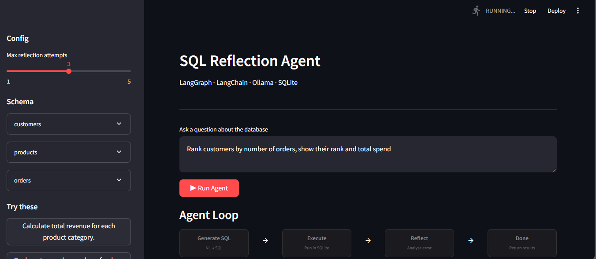
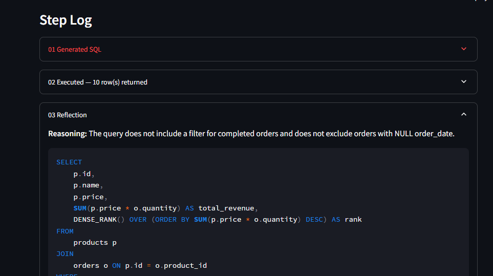
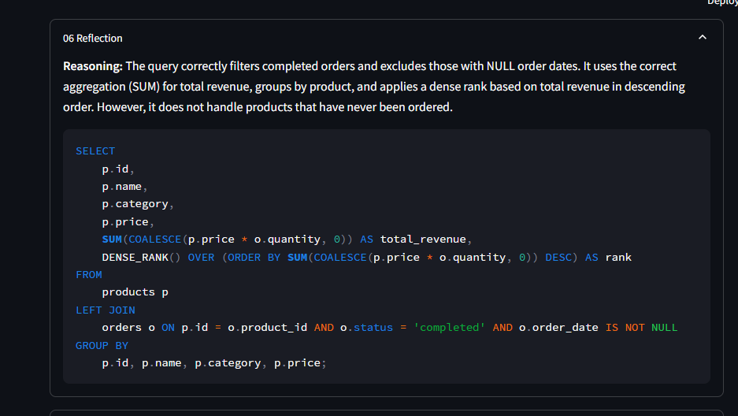
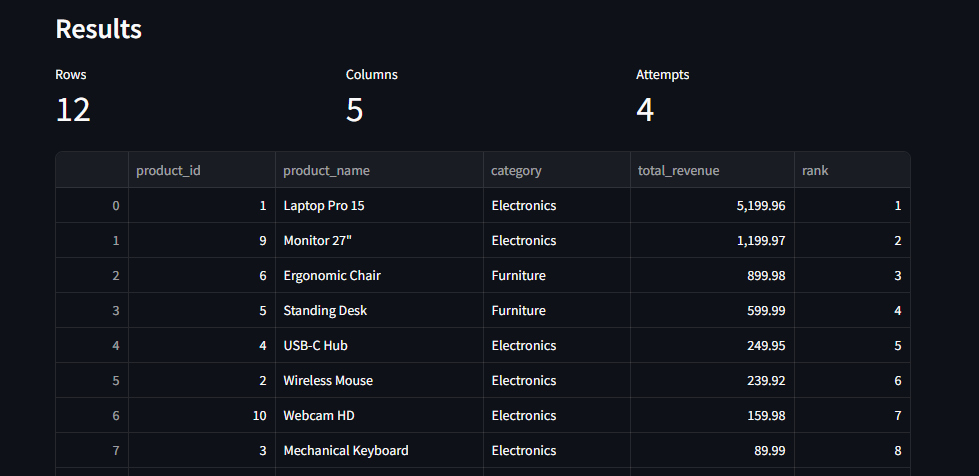

# SQL Reflection Agent

> Ask a question in plain English. Get SQL. Watch the agent think, fail, reflect, and fix itself.

---

## What is this?

Imagine you have a database full of business data — customers, orders, products — and you want answers from it. Normally you'd need to know SQL to query it. This agent removes that barrier.

You type a question like:

> *"Which customers spent the most last month?"*

The agent translates it into SQL, runs it, and returns the results. But here's the interesting part — **if the SQL fails or is logically wrong, the agent doesn't just give up**. It reads the error, reflects on what went wrong, rewrites the query, and tries again. This loop is called a **reflection loop**, and it's what makes this more than just a simple "text to SQL" tool.

---

## Demo

**1. Ask a question — the agent loop starts:**



**2. The agent reflects — catches a logical error and rewrites the SQL:**



**3. Second reflection — catches an edge case (products never ordered):**



**4. Final result — clean table output after self-correcting attempts:**



---

## How does it think?

```
You ask a question
        ↓
[Generate SQL]   ←─────────────────────────┐
        ↓                                  │
[Execute SQL]                              │
        ↓                                  │
   Did it work?                            │
   ├── Yes → [Review] → Correct? → [Done]  │
   └── No  → [Reflect on the error] ───────┘
              (max 3 attempts, then stops)
```

At each step you can see exactly what the agent is doing — what SQL it wrote, what error it got, and what it understood from that error. Nothing is hidden.

---

## Why is this interesting?

Most AI tools give you one shot. This agent mimics how a **human analyst** actually works:

1. Write a query
2. Run it
3. Read the error
4. Fix it
5. Repeat until it works

The difference is the agent can do this in seconds, and it explains its reasoning at every step.

This is a proof-of-concept for **reflection agents** — a pattern in AI where the model evaluates and corrects its own output. It's one of the building blocks of more advanced autonomous AI systems.

---

## Motivation

I built this project after reading about reflection agents and self-correcting LLM systems.

Instead of using a single-shot text-to-SQL pipeline, I wanted to explore whether an LLM could iteratively:
1. generate SQL,
2. execute it,
3. interpret failures,
4. reflect on its own mistakes,
5. and improve the query autonomously.

The goal was not just to generate SQL, but to model the iterative workflow of a human analyst debugging queries.

---

## Concepts Demonstrated

- Reflection agents / self-correcting LLM workflows
- LangGraph StateGraph orchestration
- Stateful retry and error recovery
- Tool-using AI agents
- Streaming responses with Server-Sent Events (SSE)
- Structured agent state management
- SQL safety validation
- Local LLM inference with Ollama
- FastAPI + Streamlit integration
- Transparent execution tracing

---

## Example Reflection Trace

Question:
"Which customers generated the highest revenue?"

Attempt 1:
- Generated SQL using only the `customers` table
- Execution failed due to missing revenue fields

Reflection:
- Revenue must be derived from `orders` and `products`
- Need joins and aggregation

Attempt 2:
- Re-generated SQL with joins and SUM(quantity * price)
- Query executed successfully

---

## Stack

| Layer | What it does |
|---|---|
| LangGraph | Manages the generate → execute → reflect loop |
| LangChain | Connects to the LLM |
| Ollama | Runs the AI model locally on your machine (no API keys needed) |
| FastAPI | Backend API that runs the agent |
| Streamlit | Web UI to interact with the agent |
| SQLite | In-memory database with sample e-commerce data |

---

## Sample Data

The agent comes preloaded with a small e-commerce database so you can start asking questions immediately:

- **customers** — 10 people with names, emails, cities, and join dates
- **products** — 12 items across Electronics, Furniture, and Stationery categories
- **orders** — 29 orders with quantities, dates, and statuses (completed / pending / cancelled)

Edge cases are intentionally included — customers with no orders, products never ordered, cancelled order patterns, and null dates — to make the agent work harder.

---

## Things you can ask

```
Calculate total revenue for each product category.
Rank customers by number of orders and total spend.
For each order, show the customer's previous order date.
Which customers have never placed an order?
Get orders where quantity is greater than the average for that product.
Average order value by category.
Assign dense rank to products based on total revenue.
```

---

## Project Structure

```
sql_reflection_agent/
├── app/
│   ├── agent/
│   │   ├── graph.py      # LangGraph graph — the reflection loop
│   │   ├── nodes.py      # generate_sql, execute_sql, reflect, done nodes
│   │   ├── state.py      # AgentState — what the agent remembers between steps
│   │   └── tools.py      # SQL execution + safety checks
│   ├── api/
│   │   └── routes.py     # FastAPI routes (/query, /query/stream, /schema, /health)
│   ├── core/
│   │   └── config.py     # Settings loaded from .env
│   ├── db/
│   │   └── seed.py       # SQLite setup + sample data
│   ├── utils/
│   │   └── logger.py     # Centralised logging
│   └── main.py           # FastAPI app entrypoint
├── streamlit_app/
│   └── app.py            # Streamlit UI
├── assets/               # Screenshots
├── .env.example
├── requirements.txt
├── run.py                # Single-command launcher
└── README.md
```

---

## Quickstart

### 1. Prerequisites

- Python 3.11+
- [Ollama](https://ollama.com) installed and running

### 2. Pull a model

```bash
ollama pull qwen2.5-coder   # recommended for SQL tasks
# or
ollama pull mistral:7b
```

### 3. Start Ollama with CORS enabled

```bash
OLLAMA_ORIGINS="*" ollama serve
```
Required only if Streamlit and FastAPI run on different origins.

### 4. Clone and set up

```bash
git clone <your-repo>
cd sql_reflection_agent

python -m venv .venv
source .venv/bin/activate      # Windows: .venv\Scripts\activate

pip install -r requirements.txt
```
### 5. Configure environment

Create a `.env` file in the project root:

```env
OLLAMA_BASE_URL=http://localhost:11434
OLLAMA_MODEL=qwen2.5-coder
OLLAMA_MAX_RETRIES=3
OLLAMA_RETRY_DELAY=0.5

MAX_ATTEMPTS=3
API_HOST=0.0.0.0
API_PORT=8000
API_BASE=http://localhost:8000/api
```

Defaults work out of the box — edit only if your Ollama setup differs.


### 6. Run

```bash
python run.py
```

- Streamlit UI → http://localhost:8501
- FastAPI docs → http://localhost:8000/docs

Press `Ctrl+C` to stop both servers.

---

## API Endpoints

### `GET /api/health`
Returns service status and configured model.

### `GET /api/schema`
Returns the database schema as JSON.

### `POST /api/query`
Blocking endpoint — runs the full agent and returns the complete result.

```json
{
  "question": "Top 5 customers by total spend",
  "max_attempts": 3
}
```

Response:
```json
{
  "success": true,
  "sql": "SELECT ...",
  "columns": ["name", "total"],
  "rows": [["Alice", 1329.98], ...],
  "attempts": 1,
  "step_log": [...]
}
```

### `POST /api/query/stream`
Streaming SSE endpoint — emits each agent step in real time.

Each event is one of:
- `{"type": "step", "step": {...}}` — a new step in the agent loop
- `{"type": "result", "success": true, "columns": [...], "rows": [...]}` — final result
- `{"type": "done"}` — stream complete

---

## How the Reflection Loop Works (Technical)

The agent is a **LangGraph StateGraph** with 4 nodes:

1. **`generate_sql`** — prompts Ollama with the question + full schema context. On retry, also includes the previous error and reflection. Extracts SQL from the response.
2. **`execute_sql`** — runs the SQL against SQLite. Only `SELECT` statements are allowed. On error, sets `error` in state.
3. **`reflect`** — prompts Ollama to explain what went wrong and produce corrected SQL. On success, acts as a strict reviewer checking logical correctness against the schema.
4. **`done`** — logs the final result.

**Conditional routing after `execute_sql`:**
- Success → `reflect` (one review pass)
- Error + attempts remaining → `reflect` → `generate_sql`
- Max attempts hit → `done` (returns best result so far)

**What makes it a reflection agent vs a retry loop:**
On each retry, `generate_sql` receives the original error *and* the LLM's own explanation of what went wrong. The model is correcting itself based on its own reasoning, not just re-running the same prompt.

---

## Changing the Model

Edit `.env`:

```env
OLLAMA_MODEL=mistral:7b
```

Restart with `python run.py`.

---

## Limitations

This is a proof-of-concept reflection agent, not a production-grade SQL system.

Current limitations:
- The Latency is abit high, than what is expected, because it has multiple LLM calls
- Reflection quality depends on the underlying LLM
- Large schemas may exceed prompt context limits
- Semantic correctness can still fail even if SQL executes successfully
- SQLite-oriented prompting may not generalize perfectly to all SQL dialects

Safety protections:
- Only `SELECT` statements are allowed
- Multiple SQL statements are rejected
- Queries run against an isolated demo database

---

## Extending the POC

- **Connect a real DB** — swap `seed.py` for a PostgreSQL/MySQL connection
- **Add memory** — use LangGraph checkpointing to remember past queries per session
- **Multi-agent** — add a validator agent that checks SQL before execution
- **Evaluation** — log all attempts + reflections to measure model accuracy over time
- **Auth** — add API key middleware to the FastAPI routes